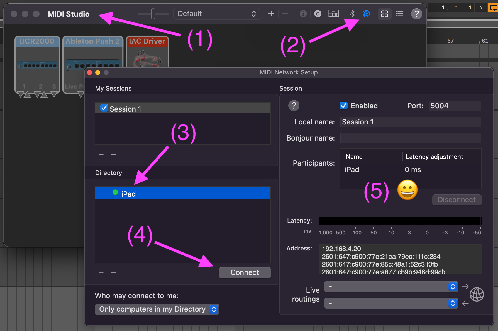
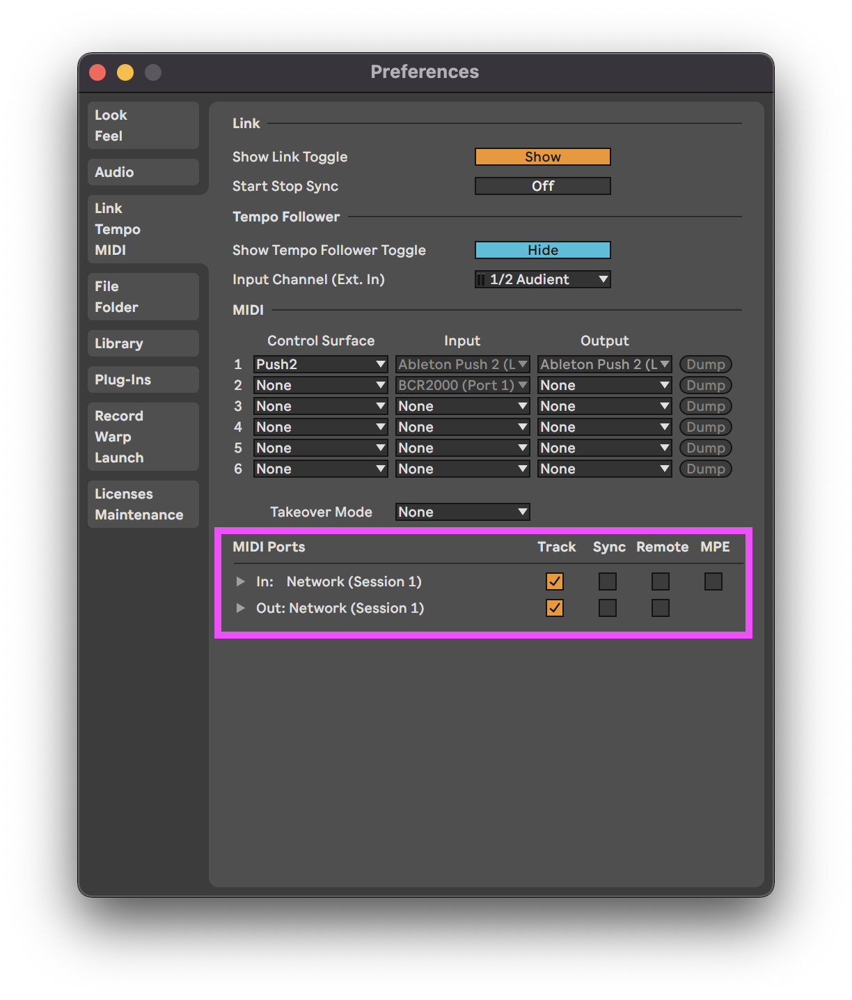
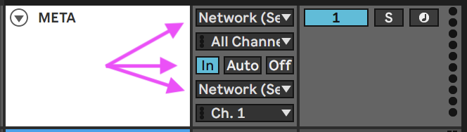

# m4l-zs-Knobbler3

This is a Max For Live device and a TouchOSC layout that provides a control surface that auto-labels parameter controls when a parameter is mapped, and minimizes the steps required to map controls.

The problem with in-the-box musicmaking is that the best control surfaces like the Push 2 are modal, requiring you to navigate menus to find parameters, and non-modal surfaces like the BCR-2000 require you to either remember knob assignments or write them on the device itself. This poses a barrier to switching between projects, or simply remembering knob assignments from day-to-day.

With the zs-Knobbler3, you get 32 auto-labeling fader controls, 10 other faders, and 8 buttons. When you map a parameter using this device, the TouchOSC layout instantly displays the parameter name, device name, and track name of the mapped parameter.

The mappings are saved with your Live Set, so you can switch between sets and your mappings (and labels!) are preserved.

## Usage

### Mapping a Parameter

Click a parameter in Ableton Live. It should be highlighted either with a rectangle (e.g. for small text boxes like Send Values) or its corners will be highlighted (e.g. knobs). Then touch the slider you want to map it to and slide up slightly, then remove your finger. You should see the parameter / device / track name show up, and the slider will jump to its current value.

### Unmapping a Slider

Click the red "X" in the upper-left corner of the TouchOSC interface. All of the sliders will change to solid red boxes. Tap the box or boxes that you want to unmap. Click the red button in the upper left corner to exit unmapping mode.

If you would prefer to unmap in the computer, you can click the "x" next to the parameter in the zs-Knobbler3 device itself.

## Installation / Setup

If you just want to download and install the device, then go to the [frozen/](https://github.com/zsteinkamp/m4l-zs-Knobbler3/tree/main/frozen) directory and download the newest version there.

### Changelog

* [1.0.0](https://github.com/zsteinkamp/m4l-zs-Knobbler3/raw/main/frozen/zs-Knobbler3-1.0.0.amxd) - 2022-03-09 - First solid, frozen release. Added zeroconf, fixed bug with inserting tracks or devices (updating parameter path when necessary).

### iPad MIDI Setup

You can use Wifi or USB to connect the computer to your iPad. Configure the Network Session MIDI connection on your Mac in the Audio MIDI Setup application (in Applications/Utilities), and connect to your iPad. Make sure you are viewing the MIDI Studio, click the little globe in that window, click the iPad, then click the "Connect" button underneath.

This will set up the iPad to use the MIDI interface called `Network (Session 1)`.

### Ableton Live MIDI Setup

You will need to configure Ableton Live to use Network (Session 1) for "Track" use (it's OK to also select Remote). See the screenshot below. Chances are you will have other MIDI devices in that list, so make sure you set up both the `In:` and `Out:` items.

### MIDI Channel Setup

The zs Knobbler3 device needs to be in a MIDI track whose input and output are the `Network (Session 1)` port. Track Monitoring needs to be set to `In`. It doesn't have to be in the only device in the track, as long as the other devices also pass along MIDI data. I like to create a track called "META" at the top of the set that contains this and other useful devices and information.

### iPad TouchOSC Host/Port Setup

The zs-Knobbler3 uses OSC (not MIDI) to communicate parameter/device/track names to TouchOSC running on the iPad. It uses service auto-discovery (zeroconf) to know what OSC devices are on the network. The dropdown list should contain your iPad. If not, you can edit the Host and Port boxes manually.

## Common Problems

#### MIDI appears to be working, but names are not updating.
This indicates that the OSC messages that the computer is sending are not reaching the iPad. Double-check the Host and Port values.

#### I get a "Spinning Beach Ball" when I try to use zs-Knobbler3.
This usually means that the Host value is incorrect. Max will do this if it is waiting for a DNS lookup to finish. Either fix the name, or use the IP address of the iPad.

#### Mapping does not work. The slider moves, but mapping does not happen.
This is usually caused by MIDI information from the iPad not reaching zs-Knobbler3. Things to check:
1) Re-open Audio MIDI Setup and ensure the iPad is still connected. If it goes to sleep or if the computer goes to sleep, it will disconnect. Using a wired/USB connection helps with this.
2) Ensure the MIDI input and output in the track that contains zs-Knobbler3 are BOTH set to `Network (Session 1)`, and that monitoring is set to `In`.

#### Moving a mapped slider on the iPad does not change the parameter value.
This usually indicates a MIDI connection problem. See "Mapping does not work" above.

#### Changing a parameter in Ableton Live does not update the slider in TouchOSC on the iPad.
This usually indicates a MIDI connection problem. See "Mapping does not work" above.

