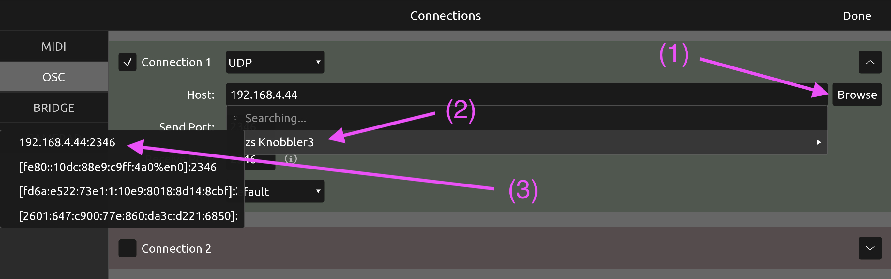
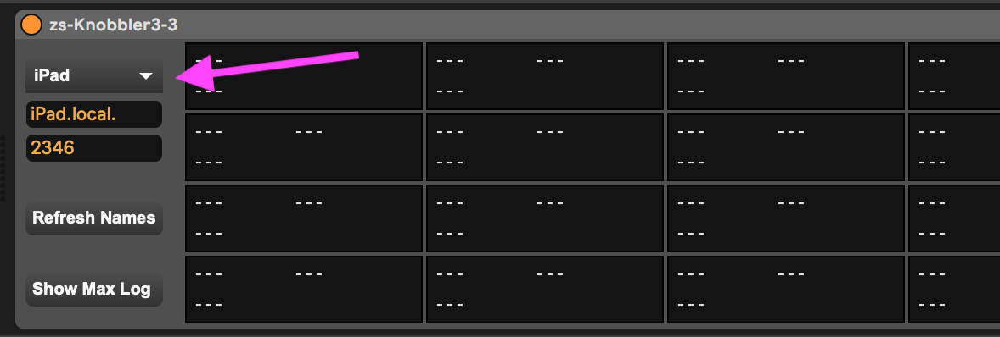

# m4l-zs-Knobbler3

## An auto-labeling control surface for Ableton Live and TouchOSC.

This is a Max For Live device and a TouchOSC layout that provides a control surface that auto-labels parameter controls when a parameter is mapped, and minimizes the steps required to map controls.

## [>>> Download Latest Version <<<](https://github.com/zsteinkamp/m4l-zs-Knobbler3/raw/main/frozen/zs-Knobbler3-1.3.0.zip)

Demo video:

The problem with in-the-box musicmaking is that the best control surfaces like the Push 2 are modal, requiring you to navigate menus to find parameters, and non-modal surfaces like the BCR-2000 require you to either remember knob assignments or write them on the device itself. This poses a barrier to switching between projects, or simply remembering knob assignments from day-to-day.

With the zs-Knobbler3, you get 16 auto-labeling fader controls. When you map one of the auto-labeling faders using this device, the TouchOSC layout instantly displays the parameter name, device name, and track name and color of the mapped parameter.

The mappings are saved with your Live Set, so you can switch between sets and your mappings (and labels!) are preserved.

It also integrates my [Bluhand](https://github.com/zsteinkamp/m4l-Bluhand) device, which allows you to control the first 16 parameters of the currently selected device on the iPad. It also incorporates [CurrentParamKnob](https://github.com/zsteinkamp/m4l-CurrentParamKnob) and [ToggleInput](https://github.com/zsteinkamp/m4l-js-toggleInput) functionality into the device and layout, which are two utilities I found to be essential to a good workflow. Functionality of these features is described below.

## Installation / Setup

If you just want to download and install the device, then go to the [frozen/](https://github.com/zsteinkamp/m4l-zs-Knobbler3/tree/main/frozen) directory and download the newest .zip file there. You can also download it directly via the links in _Changelog_ below.

You will need to have the [TouchOSC](https://hexler.net/touchosc) app installed on your iPad and configured to talk with your computer, along with the appropriate `.tosc` file on the iPad. Instructions for that are below.

If you want to use the non-frozen device (e.g. to do your own development) you will need to install the `zero.*` package. To do this, open the Package Manager in Max, then search for 'zero'. The package to install is called `zero` and it is published by Cycling '74.

### Changelog

Direct download links below. For 1.1.7 and newer, download both the `amxd` and `tosc` files! 1.1.9 introduced the tosc-16 layout option and the .zip download.

- 1.3.0 - [zip](https://github.com/zsteinkamp/m4l-zs-Knobbler3/raw/main/frozen/zs-Knobbler3-1.3.0.zip) - 2023-12-26 - Support parameter banks in the Bluhand function. Updates the TouchOSC layout with Next / Prev Bank controls.
- 1.2.1 - [zip](https://github.com/zsteinkamp/m4l-zs-Knobbler3/raw/main/frozen/zs-Knobbler3-1.2.1.zip) - 2023-09-03 - Gracefully handle the case where the iPad cannot be found, i.e. prevent infinite OSC loops.
- 1.2.0 - [zip](https://github.com/zsteinkamp/m4l-zs-Knobbler3/raw/main/frozen/zs-Knobbler3-1.2.0.zip) - 2023-04-23 - Fold the functionality of [Bluhand](https://github.com/zsteinkamp/m4l-Bluhand) into Knobbler. New tabbed TouchOSC layout that supports both.
- 1.1.9 - [zip](https://github.com/zsteinkamp/m4l-zs-Knobbler3/raw/main/frozen/zs-Knobbler3-1.1.9.zip) - 2023-04-15 - Reliability fixes, small bugfixes.
- 1.1.8 - [amxd](https://github.com/zsteinkamp/m4l-zs-Knobbler3/raw/main/frozen/zs-Knobbler3-1.1.8.amxd) [tosc](https://github.com/zsteinkamp/m4l-zs-Knobbler3/raw/main/frozen/zs-Knobbler3-1.1.8.tosc) - 2022-10-19 - Prevent feedback loop in OSC connectivitity.
- 1.1.7 - [amxd](https://github.com/zsteinkamp/m4l-zs-Knobbler3/raw/main/frozen/zs-Knobbler3-1.1.7.amxd) [tosc](https://github.com/zsteinkamp/m4l-zs-Knobbler3/raw/main/frozen/zs-Knobbler3-1.1.7.tosc) - 2022-10-10 - Have the color of the fader on the iPad follow the color of the track. Fixes an issue with ToggleInputEnable. First versioned .tosc file in the `frozen/` directory.
- [1.1.3](https://github.com/zsteinkamp/m4l-zs-Knobbler3/raw/main/frozen/zs-Knobbler3-1.1.3.amxd) - 2022-09-08 - Fix bug with auto-discovery that prevented the iPad hostname from being set properly.
- [1.1.2](https://github.com/zsteinkamp/m4l-zs-Knobbler3/raw/main/frozen/zs-Knobbler3-1.1.2.amxd) - 2022-04-28 - Integrate [CurrentParamKnob](https://github.com/zsteinkamp/m4l-CurrentParamKnob) and [ToggleInput](https://github.com/zsteinkamp/m4l-js-toggleInput) functionality into this device and the TouchOSC layout.
- [1.1.0](https://github.com/zsteinkamp/m4l-zs-Knobbler3/raw/main/frozen/zs-Knobbler3-1.1.0.amxd) - 2022-03-13 - Go all-in on OSC, no more MIDI. Much simpler, faster, and better.
- [1.0.1](https://github.com/zsteinkamp/m4l-zs-Knobbler3/raw/main/frozen/zs-Knobbler3-1.0.1.amxd) - 2022-03-09 - More confidence in fixing path saving problem.
- [1.0.0](https://github.com/zsteinkamp/m4l-zs-Knobbler3/raw/main/frozen/zs-Knobbler3-1.0.0.amxd) - 2022-03-09 - First solid, frozen release. Added zeroconf, fixed bug with inserting tracks or devices (updating parameter path when necessary).

## Setup

### TouchOSC (iPad) to Computer Connection

You will need to configure TouchOSC to send OSC to your computer. zs-Knobbler3 advertises itself on your network, so you should be able to open TouchOSC's Connections config (the chain icon), Tap OSC, then in Connection 1, tap Browse (1). You should see zs Knobbler3 in the dropdown list (2). Tap it, and then tap the IPv4 address (e.g. 192.168.x.x:2346) in the flyout menu (3).

NOTE: Max/MSP and Max For Live are limited to only working with IPv4 addresses. If you pick an IPv6 address (e.g. `[fe80:xxxx:xxxx:xxxx:xxxx%en0]:2346`) it will not work.

### Computer to TouchOSC (iPad) Connection

The zs-Knobbler3 uses OSC (not MIDI) to communicate parameter/device/track names and values to TouchOSC running on the iPad. It uses service auto-discovery (zeroconf) to know what OSC devices are on the network. The dropdown list should contain your iPad. If not, you can edit the Host and Port boxes manually. In my case, my iPad is named "iPad". You can get your iPad's name by going to Settings ... General ... About.

If the iPad does not show up in the Auto-Discovery dropdown, then you may need to enter its hostname or IP address manually. You can get the IP address of your iPad in Settings ... Wi-Fi ... then click your wi-fi network. The IP address is displayed next to "IP Address".

## Usage

### Mapping a Parameter

Ensure the "Knobbler" tab is selected on your iPad. Click a parameter in Ableton Live. It should be highlighted either with a rectangle (e.g. for small text boxes like Send Values) or its corners will be highlighted (e.g. knobs). Then touch the slider you want to map it to and slide up slightly, then remove your finger. You should see the parameter / device / track name show up, and the slider will jump to its current value.

### Unmapping a Parameter

With the Knobbler tab selected, click the red "X" in the upper-left corner of the TouchOSC interface. All of the sliders will change to solid red boxes. Tap the box or boxes that you want to unmap. Click the red button in the upper left corner to exit unmapping mode.

If you would prefer to unmap in the computer, you can click the "x" next to the parameter in the zs-Knobbler3 device itself.

### Bluhand Functionality

Bluhand lets you control the first 16 parameters of the currently selected device. Select the "Bluhand" tab in the tablet interface to see this work.

### CurrentParam and ToggleInput Functionality

The TouchOSC layout includes two additional controls at the bottom of the screen. The wide teal slider always shows the value of the currently selected parameter in your live set. This gives you use a very high-resolution way to control parameter values that does not require you to use the mouse. The yellow/orange button is a way to toggle whether input is enabled on the current track. This lets you overdub automation easily without messing up any recorded MIDI or audio clips.

## Common Problems

#### I get a "Spinning Beach Ball" when I try to use zs-Knobbler3.

This usually means that the Host value is incorrect. Max will do this if it is waiting for a DNS lookup to finish. Either fix the name, or use the IP address of the iPad.

#### My iPad doesn't show up in the Auto-Discovery dropdown.

Generally this indicates that either your computer, iPad, or your network is configured not to allow multicast UDP, also known as mDNS or Zeroconf. If you cannot work around that, then you can enter your iPad's IP address and listening port in the hostname box in the zs-Knobbler-3 device. You can get your iPad's IP address by going to Settings ... Wi-Fi ... then tap your wi-fi network name. The IP address is displayed next to "IP Address".

## TODOs

- ...
